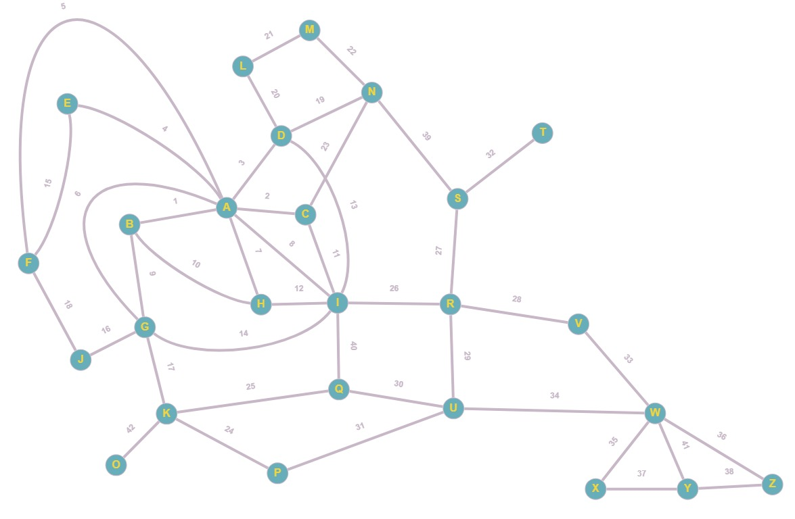

# Projeto para Disciplina Grafos
-> Alunos:
- Marcelo Pedral Mota
- Anderson Graça Araújo
- Roberdan Tamyr dos Santos
- Antonio Valenca de Souza

# Explicação:

Temos 3 arquivos, o bfs.py e o appManualDB são implementações levando em conta um grafo feito manualmente, conexo a partir dessa imagem:

-> O bfs.py é apenas a implementação do algoritmo de busca em largura, você altera no código a partir de qual vértice você deseja iniciar a busca e ele retorna a ordem que os vértices foram encontrados

-> O app, possui duas versões, ambas encontram a distância entre dois vértices, retornam o caminho que percorreu para essa distância, retornam o número de pesquisadores(Vértices) e o números de colaborações(arestas), retorna quem foi o pesquisador que mais colaborou, o que menos colaborou e as subredes de colaboração.

-> A diferença entre os app é somente em que grafo foi aplicado, o appManualDB.py é aplicado no grafo feito manualmente(vide imagem) e o appReducedDB.py foi aplicado em um Grafo reduzido de 300mil linhas. 